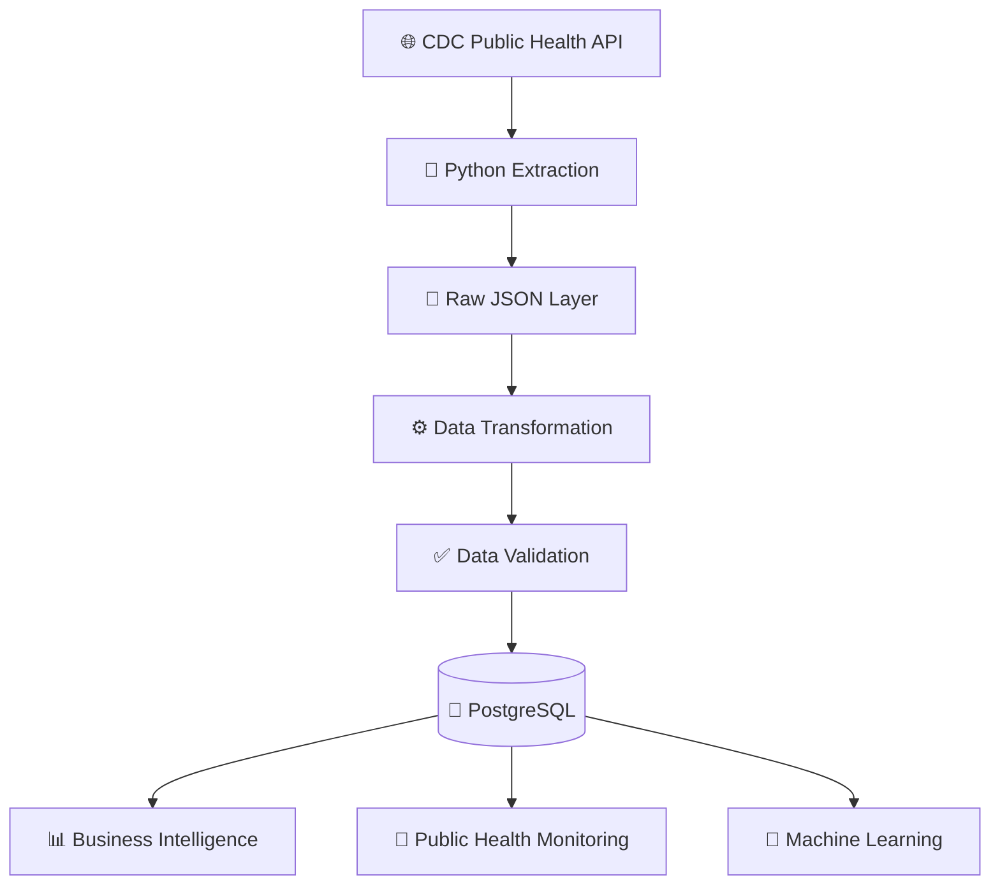

# CDC Healthcare Streaming ETL Pipeline


---

## Overview

An end-to-end healthcare data engineering pipeline that ingests public health data from the **CDC Open Data API**, applies robust transformation and validation, loads curated records into **PostgreSQL**, and drives downstream analytics, monitoring, and machine learning workloads.

Built with production data engineering practices in mind — schema standardization, automated quality gates, workflow orchestration, infrastructure-as-code, and analytics-ready data modeling.

> **Data note:** The CDC PLACES dataset contains aggregated public health statistics only. No PII or PHI is processed at any stage.

---

## Architecture



### Airflow DAG


### PostgreSQL Query Results


### Business Intelligence Output


---

## Business Problem

Healthcare organizations depend on timely, accurate data to support:

- Population health monitoring and disease surveillance
- Business intelligence reporting and executive scorecards
- Predictive modeling and public health alerts
- Insurance coverage and behavioral risk factor analysis

Raw public health data arrives with inconsistent schemas, quality issues, and mixed formats. This project demonstrates how to transform messy source data into a trusted, analytics-ready dataset.

---

## Technology Stack

| Layer | Tools |
|---|---|
| **Language** | Python 3.11, SQL |
| **Data Processing** | Pandas, NumPy |
| **Database** | PostgreSQL 15, SQLAlchemy |
| **Orchestration** | Apache Airflow |
| **Infrastructure** | Docker, Terraform |
| **Machine Learning** | Scikit-Learn (Random Forest) |
| **Cloud (Design)** | AWS S3, IAM, Redshift |
| **CI/CD** | GitHub Actions |

---

## Project Structure

```text
cdc-healthcare-streaming-etl-pipeline/
│
├── dags/
│   └── cdc_health_etl_dag.py       # Airflow DAG definition
│
├── data/
│   ├── raw/                         # Raw JSON from CDC API
│   └── processed/                   # Curated outputs
│
├── docs/
│   └── images/                      # Architecture and result screenshots
│
├── sql/
│   └── create_tables.sql            # PostgreSQL schema
│
├── src/
│   ├── config.py                    # Environment and pipeline config
│   ├── extract.py                   # CDC API ingestion
│   ├── transform.py                 # Cleaning and standardization
│   ├── validate.py                  # Data quality enforcement
│   ├── load.py                      # PostgreSQL loader
│   ├── analyze.py                   # Analytical queries
│   ├── bi_dashboard.py              # BI summary exports
│   ├── monitoring.py                # Public health alerts
│   ├── ml_model.py                  # Random Forest training + inference
│   ├── main.py                      # Single-stage runner
│   └── run_all.py                   # Full pipeline runner
│
├── terraform/
│   ├── main.tf
│   ├── variables.tf
│   └── outputs.tf
│
├── tests/
│   └── test_validation.py
│
├── docker-compose.yml
├── requirements.txt
└── README.md
```

---

## ETL Pipeline

### 1. Extract
Connects to the CDC Open Data API, retrieves health records incrementally, and archives raw JSON to the local data lake.

- Paginated API integration
- Incremental ingestion support
- Raw data preserved for reprocessing

### 2. Transform
Standardizes raw records into a consistent, analysis-ready schema.

- Column name normalization
- Data type coercion
- Missing value imputation and invalid record removal
- Text field cleaning

### 3. Validate
Enforces data quality before any records reach the database. **Quality failures stop the pipeline immediately.**

| Check | Description |
|---|---|
| Null check | Required fields must be populated |
| Type check | Values must match expected data types |
| Range check | Numeric values must fall within valid bounds |
| Schema check | Output schema must match target definition |
| Volume check | Empty datasets are rejected |

### 4. Load
Curated records are loaded into PostgreSQL via SQLAlchemy, ready for downstream consumption.

---

## Running the Project

### Prerequisites

- Docker
- Python 3.11+
- PostgreSQL (via Docker Compose)

### Start the database

```bash
docker-compose up -d postgres
```

### Install dependencies

```bash
pip install -r requirements.txt
```

### Run the full pipeline

```bash
python src/run_all.py
```

This executes all stages in order:

1. Extract from CDC API
2. Transform records
3. Validate data quality
4. Load into PostgreSQL
5. Generate BI summary outputs
6. Generate public health monitoring alerts
7. Train and evaluate ML model

---

## Outputs

### Business Intelligence
State-level summaries of health indicators — average values, record counts, min/max ranges.

```
data/processed/bi_health_indicator_summary.csv
```

Designed for downstream use in Power BI, Tableau, or executive dashboards.

---

### Public Health Monitoring
Flags health indicators exceeding configurable risk thresholds — suitable for surveillance workflows and public health alerts.

```
data/processed/public_health_alerts.csv
```

---

### Machine Learning
Trains a **Random Forest Regressor** to predict health indicator values from demographic and categorical features.

| Detail | Value |
|---|---|
| Model | Random Forest Regressor |
| Features | Year, State, Category, Health Measure |
| Target | Data Value |
| Metrics | MAE, R² Score |
| Output | `data/processed/ml_predictions.csv` |

---

### PostgreSQL Query Example

```sql
SELECT state, measure_id, AVG(data_value) AS avg_value
FROM cdc_places_health_indicators
GROUP BY state, measure_id
ORDER BY avg_value DESC;
```

---

## Infrastructure as Code

Terraform provisions the cloud infrastructure layer consistently and repeatably.

**Resources defined:**
- S3 data lake buckets (raw + processed zones)
- IAM roles with least-privilege access
- Environment variable management

```bash
terraform init
terraform plan
terraform apply
```

---

## Roadmap

- [ ] AWS S3 integration for cloud-native data lake
- [ ] AWS Glue ETL jobs
- [ ] Redshift warehouse target
- [ ] Kafka streaming ingestion
- [ ] Great Expectations for declarative data quality
- [ ] MLflow model tracking and registry
- [ ] Airflow production deployment
- [ ] Kubernetes orchestration
- [ ] CI/CD pipeline with GitHub Actions

---

## Author

**Tariqul Islam**
Data Scientist · Data Engineer · Bioinformatics Researcher

Specializations: Healthcare Analytics · Data Engineering · Machine Learning · Cloud Computing · Bioinformatics · MLOps

[](https://linkedin.com)
[](https://github.com)
