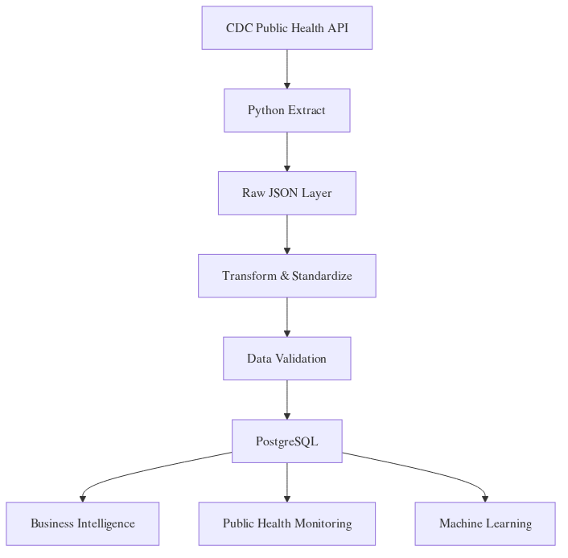
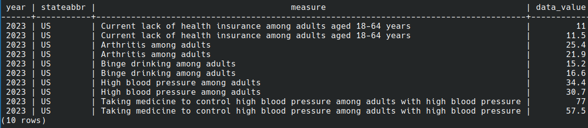

# CDC Healthcare Streaming ETL Pipeline


# CDC Healthcare Streaming ETL Pipeline

## Overview

This project demonstrates an end-to-end healthcare data engineering solution that ingests public health data from the CDC Open Data API, processes it through a scalable ETL pipeline, validates data quality, stores curated data in PostgreSQL, and generates downstream analytics, monitoring, and machine learning outputs.

The project follows modern data engineering practices including data standardization, validation, orchestration, infrastructure-as-code concepts, and analytics-ready data modeling.

---

## Business Problem

Healthcare organizations rely on timely, accurate, and reusable data to support:

* Population health monitoring
* Healthcare analytics
* Business intelligence reporting
* Predictive modeling
* Public health surveillance

Raw healthcare data often arrives from multiple sources with inconsistent schemas, quality issues, and varying formats. This project demonstrates how to transform raw public health data into a trusted analytics-ready dataset.

---

## Project Objectives

* Build a reusable ETL pipeline using Python
* Ingest healthcare-related data from a public CDC API
* Implement data validation and quality controls
* Load curated data into PostgreSQL
* Generate business intelligence datasets
* Create public health monitoring outputs
* Train machine learning models using curated data
* Demonstrate AWS-style cloud architecture
* Showcase Infrastructure-as-Code using Terraform

---

## Data Source

CDC PLACES: Local Data for Better Health

Source:

[https://data.cdc.gov](https://data.cdc.gov)

Dataset includes:

* Health indicators
* Chronic disease prevalence
* Insurance coverage metrics
* Behavioral risk factors
* Population health measures

The dataset contains aggregated public health information and does not contain personally identifiable information (PII) or protected health information (PHI).

---
## Image section
## Architecture Diagram



## PostgreSQL Query Results



## Business Intelligence Output


## Airflow DAG


## Architecture
```text
CDC Public Health API
            │
            ▼
    Python Extraction
            │
            ▼
      Raw JSON Layer
            │
            ▼
 Data Transformation Layer
            │
            ▼
 Data Quality Validation
            │
            ▼
 Curated Analytics Layer
            │
            ▼
      PostgreSQL
            │
    ┌───────┼────────┐
    ▼       ▼        ▼
 Business  Public    ML
Intelligence Health  Models
           Monitoring
```

---

## Technology Stack

### Programming

* Python
* SQL

### Data Processing

* Pandas
* NumPy

### Database

* PostgreSQL
* SQLAlchemy

### Data Engineering

* ETL Pipelines
* Data Validation
* Data Quality Monitoring

### Workflow Orchestration

* Apache Airflow

### Infrastructure

* Docker
* Terraform

### Cloud Architecture

* AWS S3 (Design)
* AWS IAM (Design)
* AWS Redshift (Future Extension)

### Machine Learning

* Scikit-Learn
* Random Forest Regressor

---

## Project Structure

```text
cdc-healthcare-streaming-etl-pipeline/

├── dags/
│   └── cdc_health_etl_dag.py
│
├── data/
│   ├── raw/
│   └── processed/
│
├── sql/
│   └── create_tables.sql
│
├── src/
│   ├── config.py
│   ├── extract.py
│   ├── transform.py
│   ├── validate.py
│   ├── load.py
│   ├── main.py
│   ├── analyze.py
│   ├── bi_dashboard.py
│   ├── monitoring.py
│   ├── ml_model.py
│   └── run_all.py
│
├── terraform/
│   ├── main.tf
│   ├── variables.tf
│   └── outputs.tf
│
├── tests/
│   └── test_validation.py
│
├── docker-compose.yml
├── requirements.txt
└── README.md
```

---

## ETL Pipeline

### Extract

The extraction layer retrieves public health records from the CDC Open Data API and stores raw JSON files in the raw data layer.

Features:

* API integration
* Incremental ingestion
* Raw data retention
* JSON archival

### Transform

The transformation layer:

* Standardizes column names
* Converts data types
* Cleans text fields
* Handles missing values
* Removes invalid records

### Validate

The validation layer performs:

* Null checks
* Data type checks
* Range validation
* Required field validation
* Data quality enforcement

### Load

The curated dataset is loaded into PostgreSQL for downstream analytics and machine learning.

---

## Data Quality Controls

Implemented quality controls include:

* Required field validation
* Missing value detection
* Data type validation
* Negative value detection
* Empty dataset detection
* Schema standardization

Quality failures immediately stop the pipeline.

---

## Business Intelligence Layer

The BI layer generates analytics-ready summary datasets.

Outputs:

* Average health indicators
* Record counts
* Minimum values
* Maximum values
* State-level summaries

Example use cases:

* Power BI dashboards
* Tableau reporting
* Executive scorecards
* Public health reporting

Output:

```text
data/processed/bi_health_indicator_summary.csv
```

---

## Public Health Monitoring

The monitoring module identifies high-risk health indicators above configurable thresholds.

Example use cases:

* Disease surveillance
* Risk monitoring
* Population health tracking
* Public health alerts

Output:

```text
data/processed/public_health_alerts.csv
```

---

## Machine Learning Layer

The machine learning component uses curated data to train a predictive model.

Model:

* Random Forest Regressor

Features:

* Year
* State
* Category
* Health Measure

Target:

* Data Value

Metrics:

* Mean Absolute Error (MAE)
* R² Score

Output:

```text
data/processed/ml_predictions.csv
```

---

## Infrastructure as Code

Terraform configuration demonstrates how cloud infrastructure can be provisioned consistently.

Resources:

* S3 Data Lake Buckets
* IAM Roles
* Environment Configuration

Benefits:

* Reproducibility
* Version Control
* Automated Provisioning
* Environment Consistency

---

## Docker Deployment

PostgreSQL is containerized using Docker.

Benefits:

* Reproducible environment
* Simplified setup
* Portable deployment
* Consistent development workflow

Start PostgreSQL:

```bash
docker-compose up -d postgres
```

---

## Running the Project

Run complete pipeline:

```bash
python src/run_all.py
```

Pipeline stages:

1. Extract CDC data
2. Transform records
3. Validate data quality
4. Load into PostgreSQL
5. Generate BI outputs
6. Generate monitoring alerts
7. Train machine learning model

---

## Example Outputs

### Curated Database

```sql
SELECT COUNT(*)
FROM cdc_places_health_indicators;
```

### Business Intelligence

Top health indicators by state and year.

### Monitoring

High-risk health indicators exceeding thresholds.

### Machine Learning

Predicted health indicator values.

---

## Future Enhancements

* AWS S3 integration
* AWS Glue ETL jobs
* Redshift warehouse integration
* Kafka streaming ingestion
* CDC incremental ingestion
* Airflow production deployment
* CI/CD pipelines
* Great Expectations data quality checks
* MLflow model tracking
* Kubernetes deployment

---

## Key Skills Demonstrated

* Python
* ETL Development
* Data Engineering
* Data Validation
* PostgreSQL
* SQL
* Docker
* Terraform
* Machine Learning
* Business Intelligence
* Healthcare Analytics
* Public Health Data
* Data Quality Management
* Cloud Architecture
* Workflow Orchestration

---

## Author

Tariqul Islam

Data Scientist | Data Engineer | Bioinformatics Researcher

Specializations:

* Healthcare Analytics
* Data Engineering
* Machine Learning
* Cloud Computing
* Bioinformatics
* MLOps

